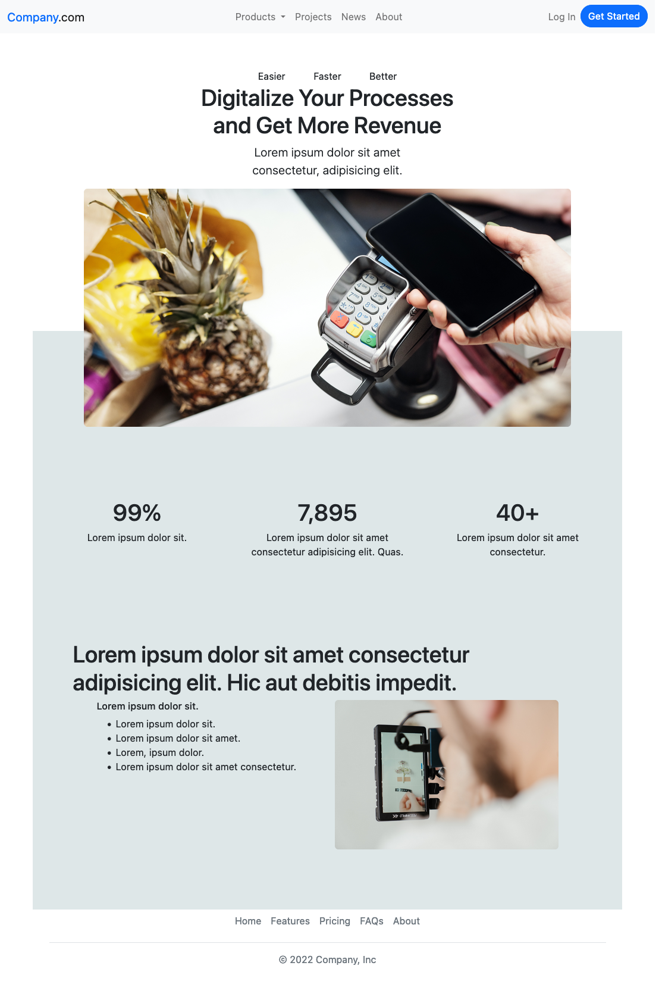

# Django Template

This is a web page made with HTML, CSS, Javascript and Boostrap, using the Django python framework. It contains a landing page as a template using the jinja structure and responsive paradigm.

As of right know it is intended just as a showcase or template for django 4.1.0 and boostrap 5. It is possible that it will be expanded in the future.

